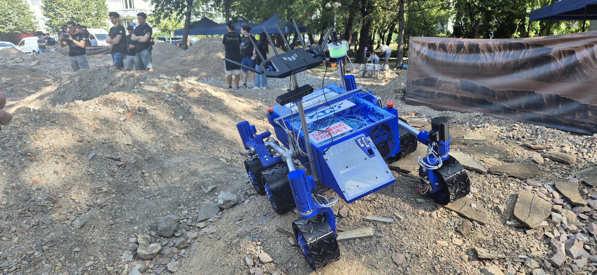

# GORM Rover Software Overview

Welcome to the GORM Rover Software Overview, the rover consists of these main ROS 2 packages:
- **`gorm_bringup`** - Main system launcher with robot state publisher and control nodes
- **`gorm_base_control`** - Ackermann Kinematics interface for 6-wheel, 4-steer kinematics (`/cmd_vel` → `/motor commands`)
- **`gorm_teleop`** - Manual control via joystick (`teleop_twist_joy_node`, `joy-to-cmd_vel converter`)
- **`gorm_sensors`** - Sensor drivers for RGBD cameras, IMU, etc.
 - **`gorm_navigation`** - Navigation stack and RL-based navigation nodes and configs
 - **`gorm_web_interface`** - Lightweight web server and web UI for monitoring and control

## Table of Contents

- [**Installation**](./getting_started/installation/installation.md): Provides a step-by-step guide to install the GORM Rover Software on the Rover.
- [**Launching**](./getting_started/launching/launching.md): Explains how to launch the GORM Rover Software, including building and running the Docker images.

